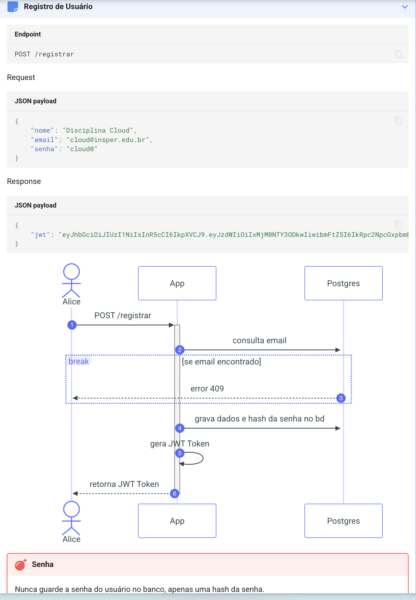
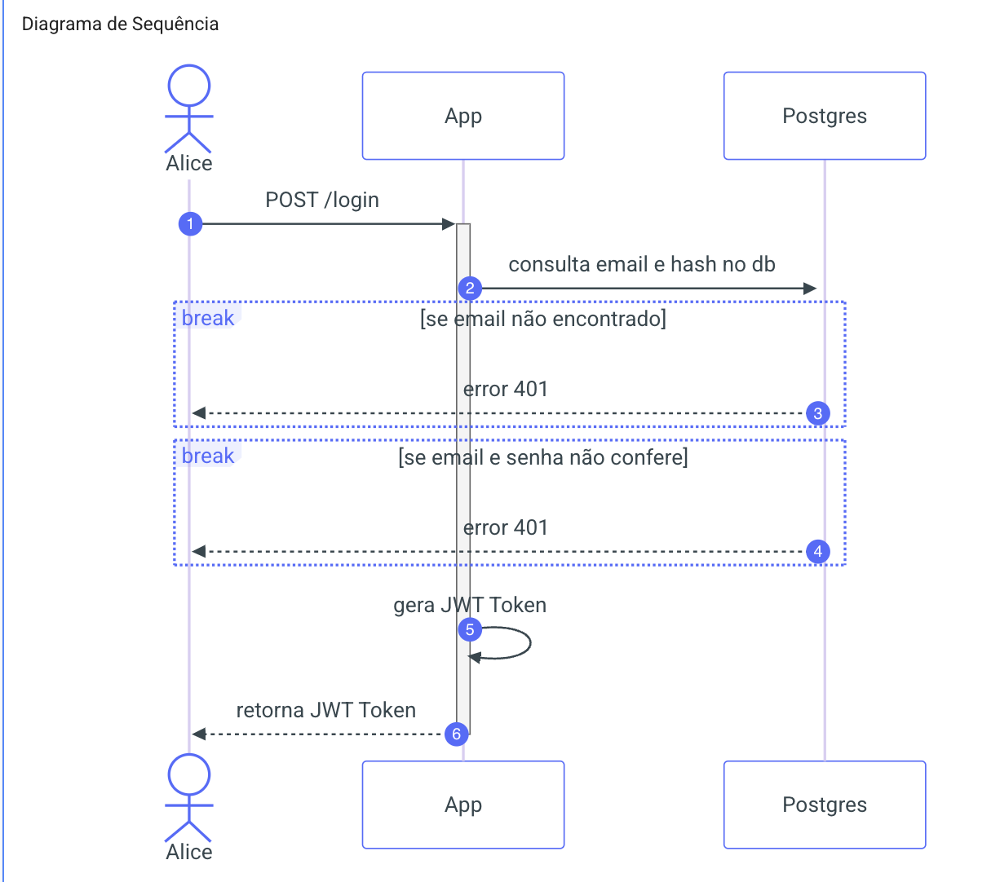
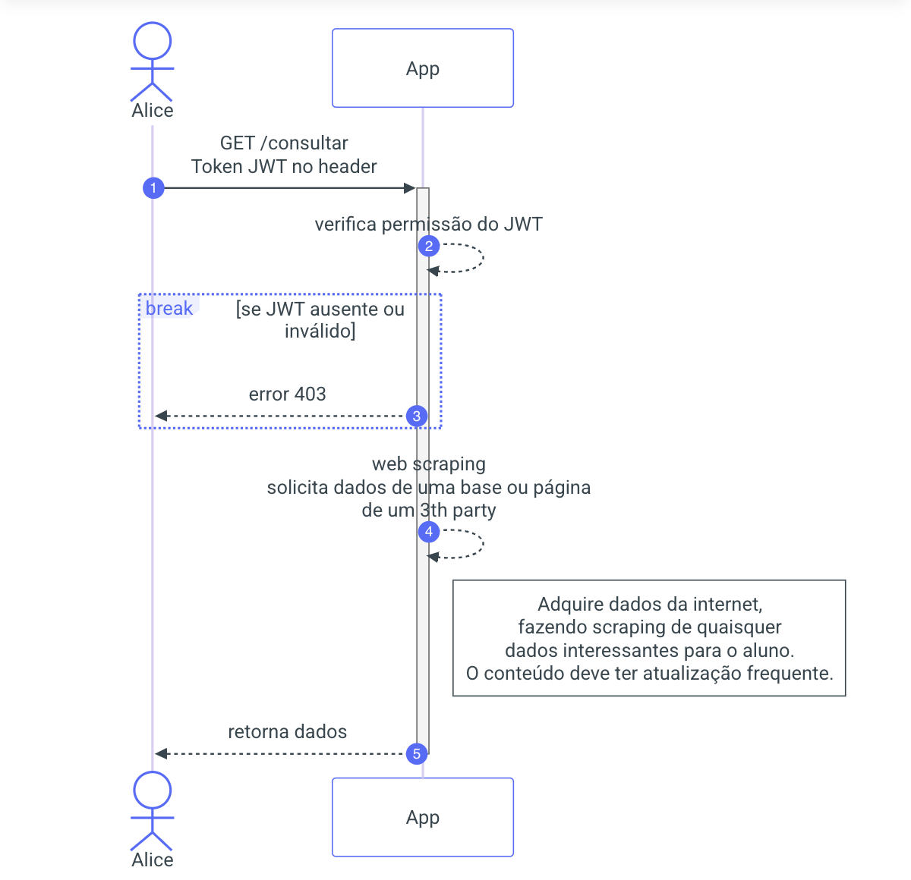
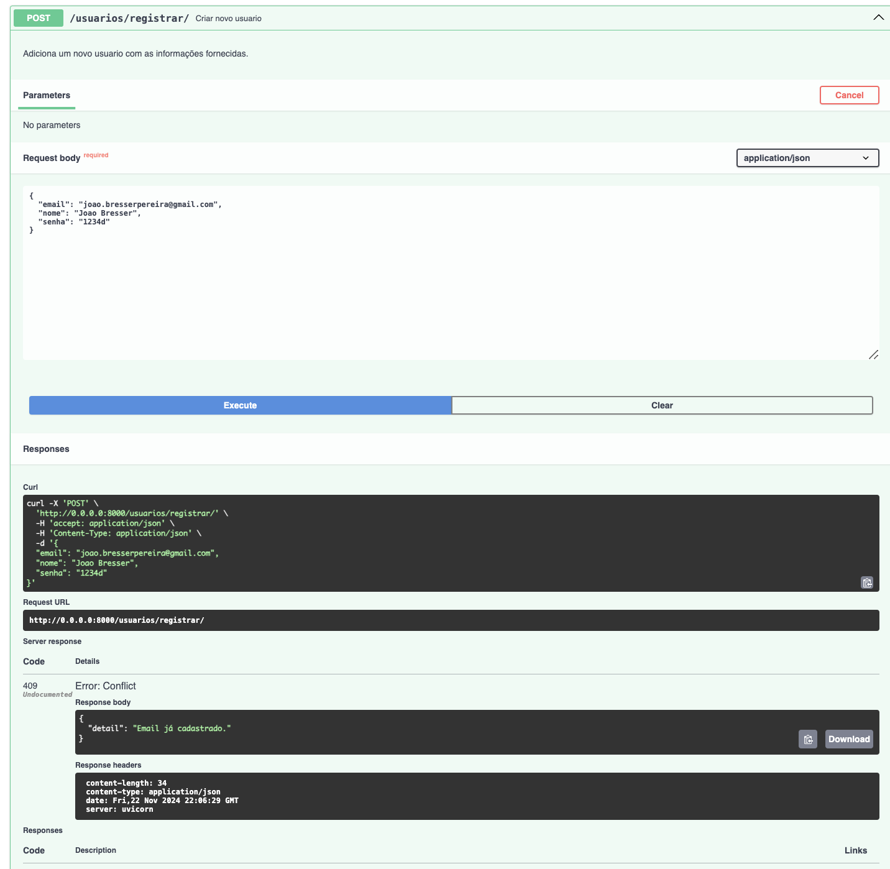
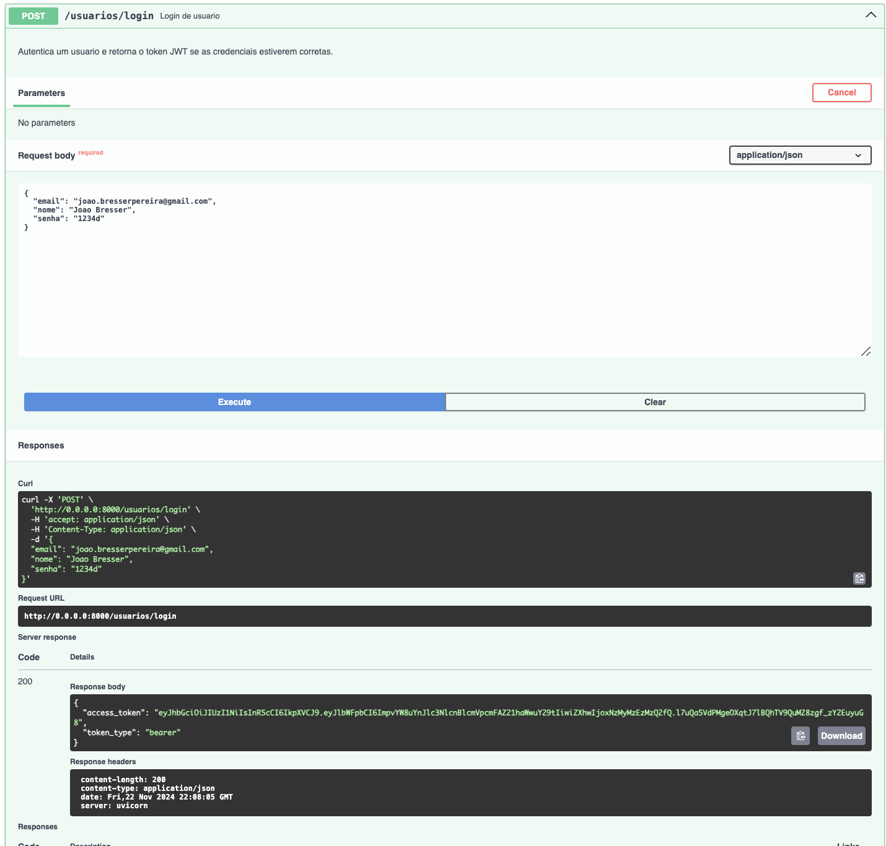
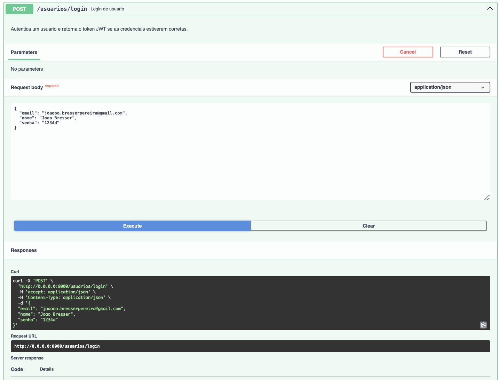
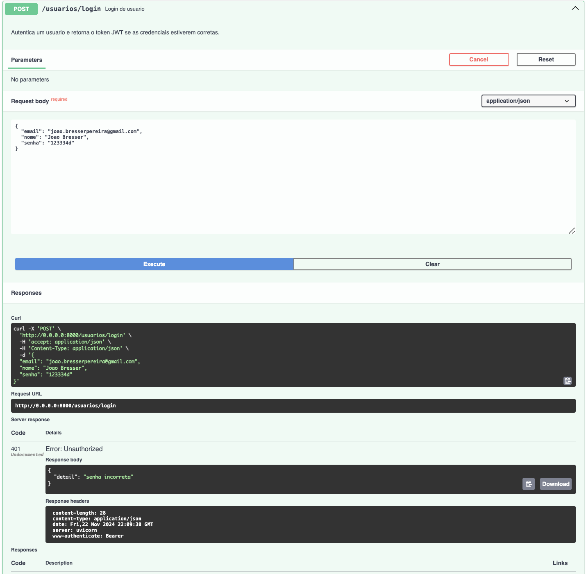
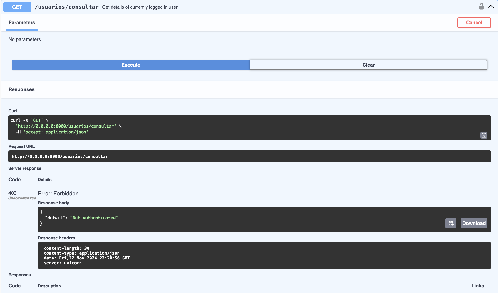
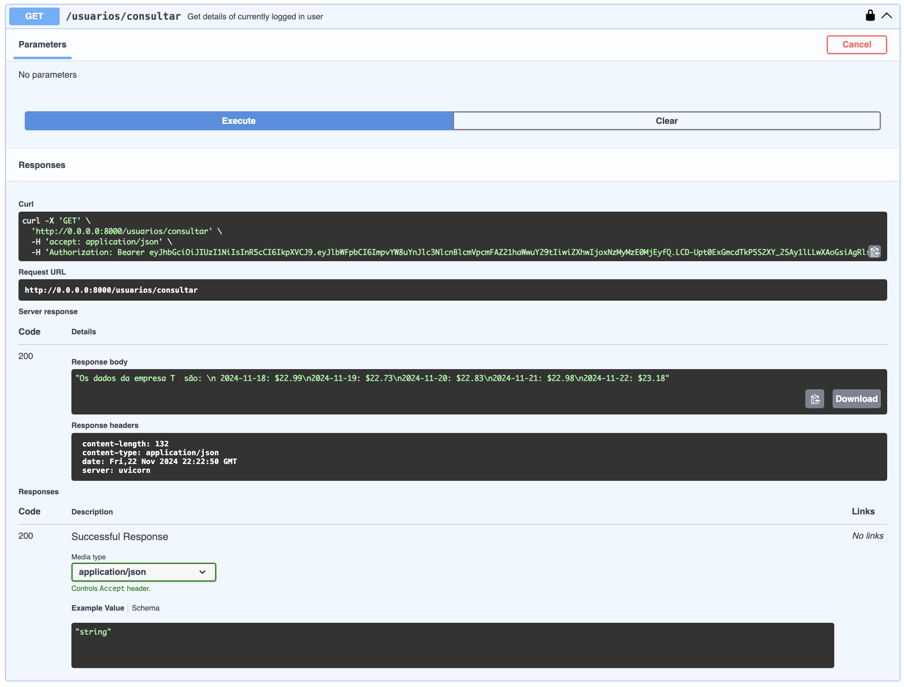

# Documentação da API

A documentação da APi também pode ser obtida pelo swagger docs:

é possivel encontrála no seguinte link:

[link codigo rodando na aws](http://a56a2d01abb4e409fb50de31aa7a7f2a-868540365.sa-east-1.elb.amazonaws.com/docs#/)

Esta API permite o gerenciamento de usuários, autenticação e acesso a informações de mercado.

---

## Endpoints

### 1. **Obter todos os usuários**

- **URL:** `/usuarios/`
- **Método:** `GET`
- **Parâmetros de Query:**
  - `offset` (int): Define o deslocamento para os resultados (padrão: `0`).
  - `limit` (int): Define o número máximo de resultados a serem retornados (máximo: `100`).
- **Resposta:**
  - **Status:** `200 OK`
  - **Corpo:** Lista de usuários no formato do esquema `UserSchema`.
- **Tags:** `Usuarios`
- **Descrição:** Retorna a lista de todos os usuários disponíveis (cadastrados).

---

### 2. **Registrar um novo usuário**

- **URL:** `/registrar/`
- **Método:** `POST`
- **Parâmetros do Corpo:**
  - Objeto do tipo `UserSchema` contendo as informações do usuário.
- **Resposta:**
  - **Status:** `201 Created`
  - **Corpo:** Objeto `Token` com o token JWT gerado para o novo usuário.
- **Erros:**
  - **Status:** `409 Conflict` – Caso o e-mail já esteja cadastrado.
- **Tags:** `Usuarios`
- **Descrição:** Adiciona um novo usuário com as informações fornecidas.
-

---

### 3. **Login de usuário**

- **URL:** `/login`
- **Método:** `POST`
- **Parâmetros do Corpo:**
  - Objeto do tipo `UserSchemaValidate` contendo `email` e `senha`.
- **Resposta:**
  - **Status:** `200 OK`
  - **Corpo:** Objeto `Token` com o token JWT gerado.
- **Erros:**
  - **Status:** `401 Unauthorized` – Caso o e-mail não esteja cadastrado ou a senha esteja incorreta.
- **Tags:** `Usuarios`
- **Descrição:** Autentica um usuário e retorna o token JWT se as credenciais estiverem corretas.

---

### 4. **Obter informações do usuário autenticado**

- **URL:** `/data`
- **Método:** `GET`
- **Cabeçalhos:**
  - `Authorization: Bearer <token>`
- **Resposta:**
  - **Status:** `200 OK`
  - **Corpo:** Dados históricos de preços de fechamento da empresa "T".
- **Erros:**
  - **Status:** `401 Unauthorized` – Caso o token esteja expirado ou seja inválido.
  - **Status:** `403 Forbidden` – Caso o esquema de autenticação seja inválido.
  - **Status:** `404 Not Found` – Caso o usuário não seja encontrado.
- **Tags:** `Usuarios`
- **Descrição:** Retorna detalhes históricos da empresa "T" (via Yahoo Finance) para o usuário autenticado.

---

### 5. **Consultar informações do usuário autenticado**

- **URL:** `/consultar`
- **Método:** `GET`
- **Cabeçalhos:**
  - `Authorization: Bearer <token>`
- **Resposta:**
  - **Status:** `200 OK`
  - **Corpo:** Dados históricos de preços de fechamento da empresa "T".
    - Formato: Uma string contendo as datas e os preços de fechamento dos últimos 5 dias.
- **Erros:**
  - **Status:** `401 Unauthorized` – Caso o token esteja expirado ou inválido.
  - **Status:** `403 Forbidden` – Caso o esquema de autenticação seja inválido.
  - **Status:** `404 Not Found` – Caso o usuário autenticado não seja encontrado.
- **Tags:** `Usuarios`
- **Descrição:** Retorna os dados históricos de mercado da empresa "T" (via Yahoo Finance) para o usuário atualmente autenticado.

---

# Testagem endpoints

# Registrar

## Registrar Funcionando

## Registrar já cadastrado

# Login

## Login Funcionando

## Login com email não encontrado

## Login senha não encontrada

# Consultar

## Consultar sem login

## Conulta credenciais invalidas

## Consulta com login

